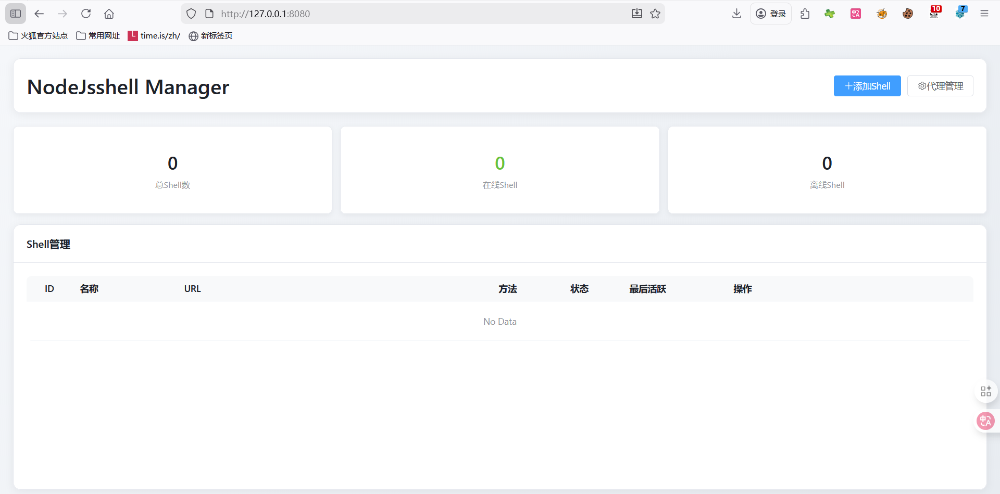
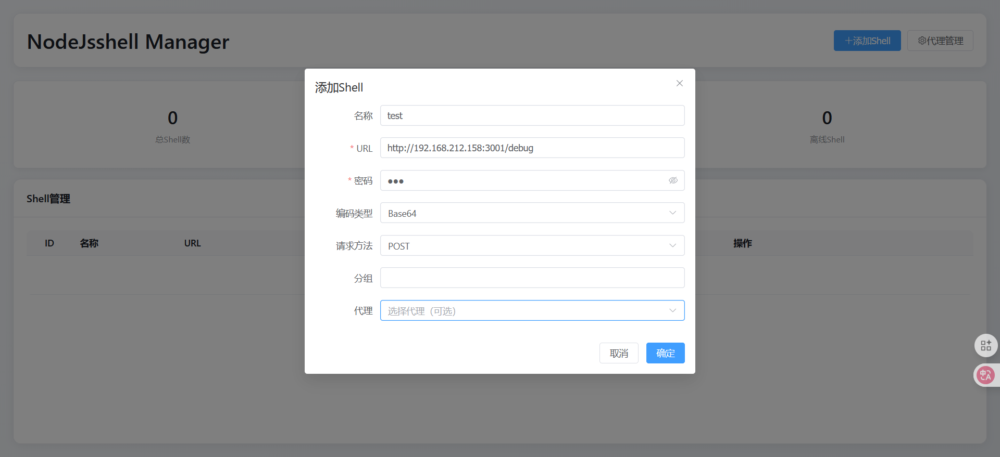
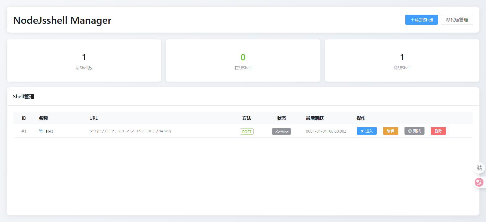
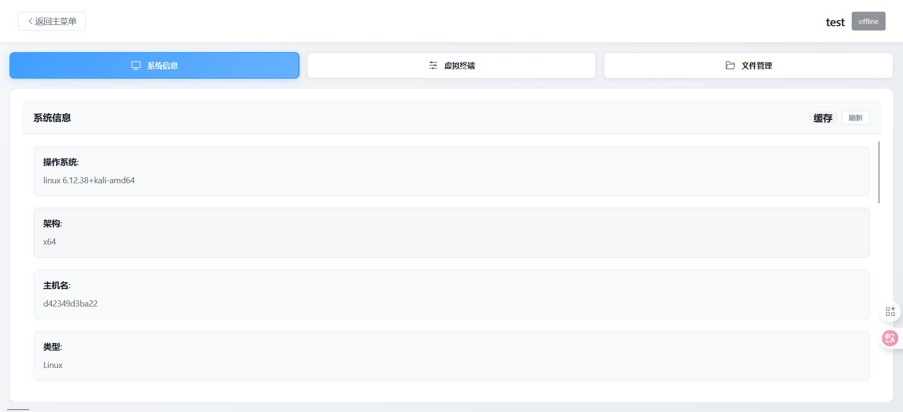
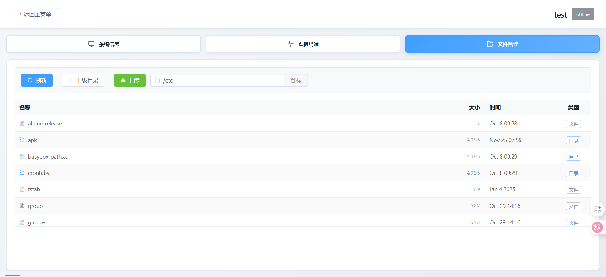
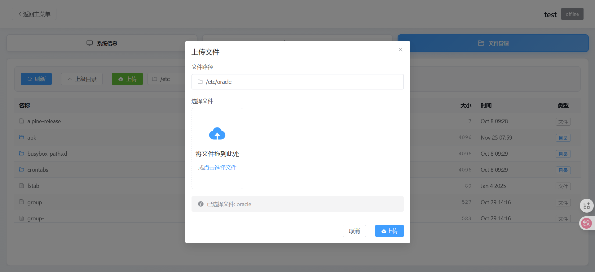
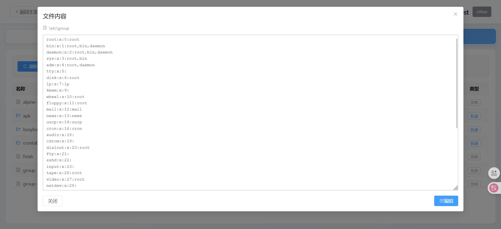

# TL-NodeJsShell<div align="center">


**现代化的 Node.js WebShell 管理平台**

[English](README_EN.md) | 简体中文

</div>

---

## 法律免责声明

**本工具仅用于授权的安全测试和教育目的。**

- 用户必须在测试任何系统之前获得明确许可
- 未经授权访问计算机系统是非法的
- 用户对自己的行为负全部责任
- 作者不对滥用或损害承担任何责任

## 项目简介

TL-NodeJsShell 是一个为安全专业人员和渗透测试人员设计的综合性 WebShell 管理平台。它提供了一个现代化的 Web 界面，用于管理基于 Node.js 的 Shell，具有内存马注入、命令执行、文件管理和代理支持等高级功能。

## 主要特性

- **内存马注入**
 - Express 中间件注入
 - Koa 中间件注入
 - 原型链污染技术
 - 多种编码方式（Base64、XOR、AES）

- **交互式终端**
 - 实时命令执行
 - 基于 xterm.js 的虚拟终端
 - 命令历史记录
 - 多 Shell 管理

- **文件管理**
 - 文件浏览器与目录导航
 - 文件上传/下载（支持大文件分块传输）
 - 文件预览和编辑
 - Monaco 编辑器集成

- **安全特性**
 - 支持多种编码类型
 - 自定义 HTTP 头
 - 代理支持（HTTP/HTTPS/SOCKS5）
 - 密码保护

- **现代化界面**
 - Vue 3 + TypeScript 前端
 - Element Plus 组件库
 - 响应式设计
 - 实时状态监控

## 截图展示

<div align="center">










</div>

## 项目架构

```
TL-NodeJsShell/
├── server/    # Go 后端服务器
│ ├── cmd/    # 入口文件
│ ├── internal/  # 内部逻辑
│ │ ├── app/   # 应用核心
│ │ ├── config/  # 配置
│ │ ├── core/  # 核心功能
│ │ ├── database/ # 数据库模型
│ │ └── handlers/ # HTTP 处理器
│ └── go.mod
├── web/     # Vue.js 前端
│ ├── src/
│ │ ├── api/  # API 客户端
│ │ ├── components/ # Vue 组件
│ │ ├── router/  # Vue 路由
│ │ ├── stores/  # Pinia 状态管理
│ │ ├── types/  # TypeScript 类型
│ │ └── views/  # 页面视图
│ └── public/   # 静态资源
└── docs/    # 文档资源
```

## 快速开始

### 环境要求

- Go 1.21 或更高版本
- Node.js 16 或更高版本
- npm 或 yarn

### 安装步骤

1. **克隆仓库**
```bash
git clone https://github.com/tianlusec/TL-NodeJsShell.git
cd TL-NodeJsShell
```

2. **构建并运行后端**
```bash
cd server
go mod download
go build -o NodeJsshell cmd/api/main.go
./NodeJsshell
```

3. **构建并运行前端**
```bash
cd web
npm install
npm run build
```

4. **访问应用**
```
在浏览器中打开: http://localhost:8080
```

### 开发模式

**后端:**
```bash
cd server
go run cmd/api/main.go
```

**前端:**
```bash
cd web
npm run dev
```

## 使用说明

### 1. 添加 Shell

- 导航到 Shell 管理器
- 点击"添加 Shell"
- 配置：
 - 目标 URL
 - 密码
 - 编码类型（Base64/XOR/AES）
 - HTTP 方法（GET/POST）
 - 可选：代理设置
 - 可选：自定义请求头

### 2. 管理 Shell

- 查看所有已连接的 Shell
- 测试连接状态
- 查看系统信息
- 监控延迟

### 3. 执行命令

- 选择一个 Shell
- 使用虚拟终端
- 实时执行命令
- 查看命令历史

### 4. 文件操作

- 浏览远程文件系统
- 上传文件（大文件支持分块传输）
- 下载文件
- 预览和编辑文件

### 5. Payload 生成

- 选择模板类型
- 配置编码方式
- 生成 Payload
- 复制并部署

## 配置说明

后端配置位于 `server/internal/config/config.go`：

```go
type Config struct {
 Port string // 默认: "8080"
 Host string // 默认: "0.0.0.0"
}
```

## 技术栈

**后端:**
- Go 1.21+
- Gin Web 框架
- GORM (SQLite)
- Gorilla WebSocket

**前端:**
- Vue 3
- TypeScript
- Element Plus
- Vite
- Pinia（状态管理）
- Vue Router
- Axios
- xterm.js
- Monaco Editor

## 文档

- [安装指南](docs/INSTALLATION.md)
- [API 文档](docs/API.md)
- [安全策略](docs/SECURITY.md)
- [贡献指南](.github/CONTRIBUTING.md)
- [项目结构](PROJECT_STRUCTURE.md)

## 贡献指南

欢迎贡献！请阅读 [CONTRIBUTING.md](.github/CONTRIBUTING.md) 了解我们的行为准则和提交拉取请求的流程。

## 许可证

本项目采用 MIT 许可证 - 详见 [LICENSE](LICENSE) 文件。

## 致谢

- 感谢所有贡献者
- 受各种 WebShell 管理工具启发
- 使用现代 Web 技术构建

## 联系方式

- GitHub: [@tianlusec](https://github.com/tianlusec)
- Issues: [GitHub Issues](https://github.com/tianlusec/TL-NodeJsShell/issues)

---

<div align="center">

** 如果这个项目对你有帮助，请给它一个星标！**

</div>
